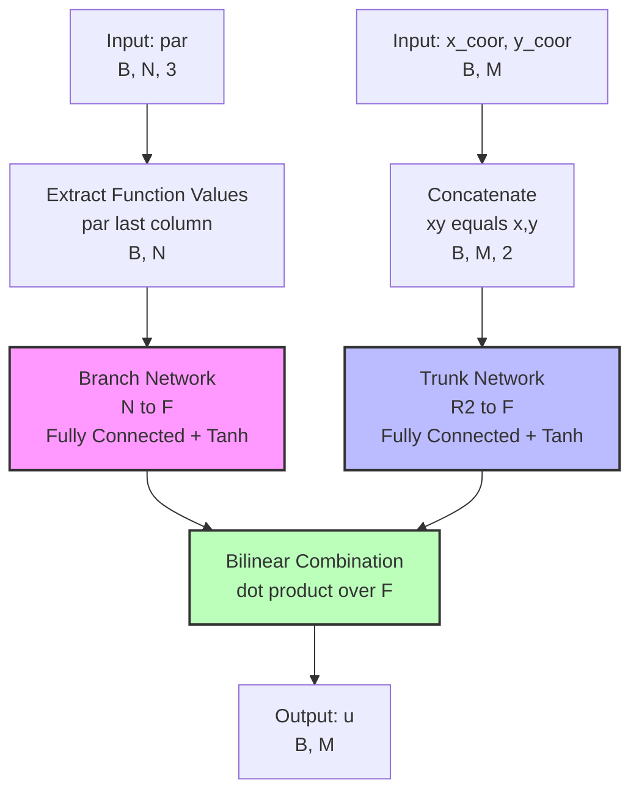
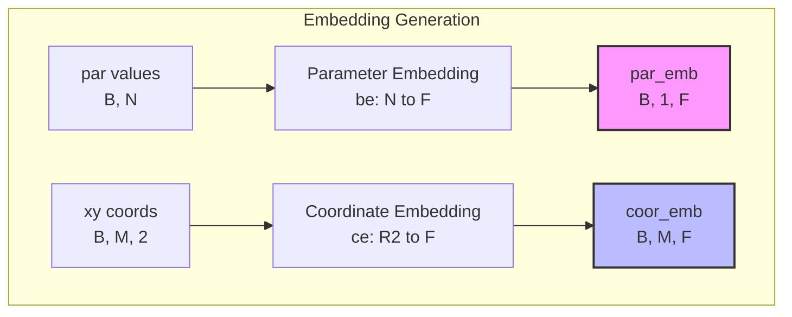
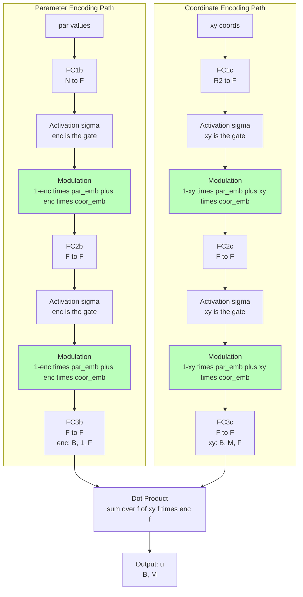
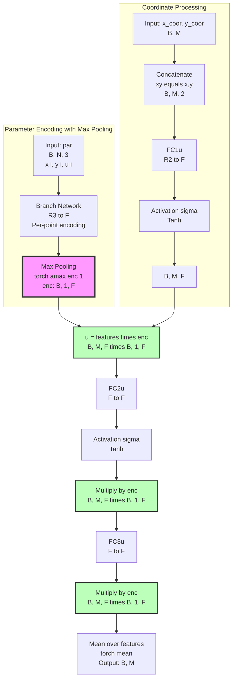

# Neural Network Architecture Report for PI-DCON

## Corrections Log

**Date:** 2026-01-06
**Changes:** Critical errors corrected based on source code verification

1. **Improved DeepONet Gating Mechanism** (Lines 129-149, 171-201)
   - **ERROR**: Report described separate gate computation `gate1 = σ(enc)`
   - **CORRECTED**: The activated features themselves serve as gates (self-gating)
   - **Impact**: Simplified the description to match actual implementation where `enc` and `xy` directly control blending without separate gate variables

2. **DCON Final Operation** (Line 256)
   - **ERROR**: Used Σ (sum) symbol with "mean" description
   - **CORRECTED**: Changed to explicit "Mean_f" notation for clarity
   - **Impact**: Notational consistency

3. **DCON Block Diagram** (Lines 278-284)
   - **ERROR**: Missing final multiplication by `enc` before mean operation
   - **CORRECTED**: Added `M → N[ Multiply by enc] → O[Mean]` flow
   - **Impact**: Diagram now accurately reflects the triple multiplication pattern in forward pass

4. **Improved DeepONet Plate Architecture** (Lines 211-214)
   - **ERROR**: Described "shared trunk gate computation (though separate layers)"
   - **CORRECTED**: Clarified that parameter encoding is shared, but trunk networks are completely independent
   - **Impact**: Removes confusion about shared computation between u and v fields

5. **DCON FC4u Layer** (Line 309)
   - **ERROR**: Ambiguous comment "not used in code"
   - **CORRECTED**: Clarified as "vestigial" - defined but absent from forward pass
   - **Impact**: Better understanding of dead code in the architecture

---

## Overview

This report documents the neural network architectures implemented in the PI-DCON (Physics-informed Discretization-independent Deep Compositional Operator Network) project. The codebase implements three main neural operator architectures for solving PDEs on irregular geometries:

1. **DeepONet (DON)** - The standard Deep Operator Network
2. **Improved_DeepONet (IDON)** - Enhanced version with trainable embeddings and gating
3. **DCON** - The novel Deep Compositional Operator Network with coordinate-aware encoding

These models are implemented for two PDE problems:
- **Darcy Flow** (single output: pressure field)
- **Plate Stress** (two outputs: displacement fields u and v)

## Common Architecture Principles

### Input Representation
All models share a common input structure:
- **Spatial coordinates**: `(x_coor, y_coor)` - Shape: `(B, M)` where B=batch size, M=number of collocation points
- **PDE parameters**: `par` - Shape: `(B, N, 3)` where each row is `(x, y, u)` for boundary collocation points

The parameter tensor `par` contains discretization-independent function observations, allowing the models to handle arbitrary numbers of boundary points.

### Output Structure
- **Darcy Flow**: Single solution field `u` with shape `(B, M)`
- **Plate Stress**: Two solution fields `(u, v)` with shape `(B, M)` each

---

## 1. DeepONet Architecture

### Darcy Flow Implementation (`DeepONet_darcy`)

#### Mathematical Formulation

The standard DeepONet computes the solution as:

```
u(x, y; par) = Σᵢ trunkᵢ(x, y) × branchᵢ(par)
```

Where:
- `branch: ℝᴺ → ℝᶠ` encodes the PDE parameters (function values only)
- `trunk: ℝ² → ℝᶠ` encodes the spatial coordinates
- `f` is the feature dimension (fc_dim)

**Forward Pass Equations:**

1. **Branch Network** (Lines 41, 13-18 in `models.py`):
```
enc = branch(par[...,-1])  # Only uses function values, ignoring coordinates
branch: ℝᴺ → ℝᶠ
```

2. **Trunk Network** (Lines 44-45, 21-26 in `models.py`):
```
xy = concat(x_coor, y_coor)  # Shape: (B, M, 2)
x = trunk(xy)  # Shape: (B, M, F)
trunk: ℝ² → ℝᶠ
```

3. **Bilinear Combination** (Line 46 in `models.py`):
```
u = einsum('bij,bj->bi', x, enc)  # Sum over feature dimension
u(x,y) = Σ_f trunk_f(x,y) × branch_f(par)
```

#### Block Diagram



#### Implementation Details
- **Branch layers**: One input layer + (N_layer-1) hidden layers + one output layer
- **Trunk layers**: Same structure as branch
- **Activation**: Tanh for all hidden layers
- **Feature dimension**: `fc_dim` (default: 512 from config)
- **Depth**: `N_layer` (default: 3 from config)

### Plate Stress Implementation (`DeepONet_plate`)

The plate version extends DeepONet to handle two output fields:

```
u(x, y; par) = Σᵢ trunk1ᵢ(x, y) × branch1ᵢ(par)
v(x, y; par) = Σᵢ trunk2ᵢ(x, y) × branch2ᵢ(par)
```

**Key Differences:**
- Uses separate branch/trunk networks for each output field
- `fc` helper class creates Tanh-activated linear layers (Lines 195-203)
- Same architecture but independent parameters for u and v fields

---

## 2. Improved DeepONet Architecture

### Darcy Flow Implementation (`Improved_DeepOnet_darcy`)

#### Mathematical Formulation

The improved version introduces:
1. **Trainable embeddings** for parameters and coordinates
2. **Gating mechanism** for feature modulation
3. **Skip connections** in the forward pass

**Forward Pass Equations:**

1. **Embeddings** (Lines 88-89 in `models.py`):
```
par_emb = be(par[...,-1]).unsqueeze(1)   # Parameter embedding: (B, 1, F)
coor_emb = ce(xy)                        # Coordinate embedding: (B, M, F)
```

2. **Parameter Encoding with Gating** (Lines 92-98):
```
enc = FC1b(par[...,-1]).unsqueeze(1)
enc = σ(enc)                            # enc itself serves as the gate [0, 1] range
enc = (1 - enc) × par_emb + enc × coor_emb  # Modulated features
enc = FC2b(enc)
enc = σ(enc)                            # enc itself serves as the gate
enc = (1 - enc) × par_emb + enc × coor_emb
enc = FC3b(enc)  # Final encoding: (B, 1, F)
```

3. **Coordinate Encoding with Gating** (Lines 101-107):
```
xy = FC1c(xy)
xy = σ(xy)                            # xy itself serves as the gate
xy = (1 - xy) × par_emb + xy × coor_emb
xy = FC2c(xy)
xy = σ(xy)                            # xy itself serves as the gate
xy = (1 - xy) × par_emb + xy × coor_emb
xy = FC3c(xy)  # Final coordinate features: (B, M, F)
```

4. **Output Combination** (Line 110):
```
u = Σ_f xy_f × enc_f  # Dot product over feature dimension
```

#### Block Diagram





#### Key Innovations

1. **Self-Gating Mechanism**: The activated features themselves serve as gates (no separate gate computation), providing a simpler form of gated modulation where `enc` and `xy` values directly control blending
2. **Information Fusion**: Interpolates between parameter-space and coordinate-space representations via convex combination: `(1-gate) × par_emb + gate × coor_emb`
3. **Skip Connections**: Embeddings are reused at multiple layers for stable gradient flow

### Plate Stress Implementation (`Improved_DeepONet_plate`)

The plate version extends the improved architecture with:
- **Shared parameter encoding**: Single parameter encoder used for both u and v outputs
- **Separate coordinate encodings**: Independent trunk networks for u and v fields
- **No shared trunk computation**: Each field (u and v) has its own completely independent gated coordinate processing path

---

## 3. DCON Architecture

### Darcy Flow Implementation (`DCON_darcy`)

#### Mathematical Formulation

The DCON architecture introduces **coordinate-aware parameter encoding** with **max pooling**:

**Forward Pass Equations:**

1. **Coordinate-Aware Parameter Encoding** (Lines 147-148 in `models.py`):
```
enc = branch(par)  # Takes full (x,y,u) as input: ℝ³ᴺ → ℝᶠ
enc = torch.amax(enc, 1, keepdim=True)  # Max pooling over N points
enc: (B, 1, F)  # Discretization-invariant encoding
```

The branch network processes each boundary point with its coordinates and function value:
```
enc_i = branch(par_i) where par_i = (x_i, y_i, u_i)  # Per-point encoding
enc = max_i(enc_i)  # Global encoding via max pooling
```

2. **Coordinate Processing** (Lines 151-154):
```
xy = concat(x_coor, y_coor)  # (B, M, 2)
u = FC1u(xy)  # (B, M, F)
u = σ(u)  # Tanh activation
```

3. **Compositional Multiplication** (Lines 156, 158, 159):
```
u = u × enc  # Broadcasting: (B, M, F) × (B, 1, F)
u = FC2u(u)  # Process modulated features: ℝᶠ → ℝᶠ
```

4. **Output Generation** (Lines 161):
```
u = Mean_f(u × enc)_f  # Mean over feature dimension
```

#### Block Diagram



#### Implementation Details

**Branch Network Architecture** (Lines 120-125):
```python
branch_layers = [
    Linear(3, fc_dim), Tanh(),  # Input: (x, y, u)
    Linear(fc_dim, fc_dim), Tanh(),  # N_layer-1 hidden layers
    Linear(fc_dim, fc_dim)  # Output layer
]
```

**Trunk Network Architecture** (Lines 128-132):
```python
# Three active layers with compositional multiplication
FC1u: ℝ² → ℝᶠ
FC2u: ℝᶠ → ℝᶠ
FC3u: ℝᶠ → ℝᶠ
FC4u: ℝᶠ → 1  # Defined at line 131 but not used in forward pass (vestigial)
```

**Key Operations**:
- **Max pooling** at line 148: `enc = torch.amax(enc, 1, keepdim=True)`
- **Broadcast multiplication** at line 156: `u = u * enc`
- **Feature averaging** at line 161: `torch.mean(u * enc, -1)`
- **Bias removal**: No bias in final output projection (implicit)

#### Key Innovations

1. **Discretization Independence**: Max pooling over N boundary points makes the encoding invariant to the number of input points
2. **Coordinate-Aware Encoding**: Branch processes (x_i, y_i, u_i) triplets, not just u_i values
3. **Compositional Architecture**: Repeated feature modulation via multiplication with encoding
4. **Information Fusion**: Spatial information encoded at both parameter and coordinate levels

### Plate Stress Implementation (`DCON_plate`)

#### Key Differences from Darcy Version

1. **Dual Output**: Two separate branches for u and v fields:
```python
# u-field processing
u = FC1u(xy) → σ → ×enc → FC2u → σ → ×enc → FC3u → Σenc

# v-field processing  
v = FC1v(xy) → σ → ×enc → FC2v → σ → ×enc → FC3v → Σenc
```

2. **Additional Lifting Layers** (Lines 354-355):
```python
self.lift = Linear(3, fc_dim_branch)      # For coordinates (not used in forward)
self.val_lift = Linear(1, fc_dim_branch)  # For values (not used in forward)
```

3. **Shared Encoding**: Both branches use the same encoding `enc` from the max-pooled boundary information

#### Architecture Extensions for Vector Fields

For plate stress problems, the same encoding `enc` modulates two independent trunk networks:

```
u(x,y) = Σ_f trunk_u_f(x,y) × enc_f(x,y,u)
v(x,y) = Σ_f trunk_v_f(x,y) × enc_f(x,y,u)
```

Where `enc_f` is computed once via max pooling then reused for both displacement components.

---

## Architecture Comparison Summary

| Feature | DeepONet | Improved DeepONet | DCON |
|---------|----------|-------------------|------|
| **Parameter Encoding** | Function values only | Trainable embeddings | Full (x,y,u) triplets |
| **Encoding Strategy** | Direct FC | Gated modulation | Max pooling |
| **Discretization Handling** | Fixed N (batches) | Fixed N (batches) | Invariant to N |
| **Coordinate Integration** | Only in trunk | Gated fusion | Encoded via max pool |
| **Key Operation** | Bilinear product | Gated bilinear | Compositional product |
| **Complexity** | Low | Medium | Medium-High |

---

## Mathematical Notation Guide

### Dimensions
- **B**: Batch size
- **N**: Number of boundary collocation points (variable per sample)
- **M**: Number of domain collocation points (fixed coordinate grid)
- **F**: Feature dimension (`fc_dim`, typically 512)

### Functions
- **σ**: Activation function (Tanh)
- **enc**: Parameter encoding from branch network
- **xy**: Spatial coordinates or coordinate features
- **u**: Solution field (pressure for Darcy, displacement for plate)
- **v**: Second solution field (plate stress only)

### Operators
- **⊗**: Element-wise multiplication with broadcasting
- **Σ_f**: Sum over feature dimension
- **maxᵢ**: Max pooling over boundary points

---

## Code References

All model implementations can be found in:
```
Main/models.py
```

Key line numbers for each component:
- **DeepONet_darcy**: Lines 7-48
- **Improved_DeepOnet_darcy**: Lines 50-112
- **DCON_darcy**: Lines 114-163
- **DeepONet_plate**: Lines 205-261
- **Improved_DeepONet_plate**: Lines 263-338
- **DCON_plate**: Lines 340-407

Configuration files located in:
```
Main/configs/
```

Example config: `DCON_Darcy_star.yaml` (Lines 1-12)
```yaml
model:
  fc_dim: 512
  N_layer: 3
```

Training implementations:
- Darcy: `Main/exp_pinn_darcy.py` and `Main/darcy_utils.py`
- Plate: `Main/exp_pinn_plate.py` and `Main/plate_utils.py`

---

## Architecture Evolution Insights

1. **From DeepONet to DCON**: The progression shows increasing integration of spatial and parameter information:
   - DeepONet: Separate processing
   - Improved DeepONet: Gated interaction
   - DCON: Direct encoding of spatial-parameter pairs with pooling

2. **Discretization Independence**: DCON's max pooling operation is the key innovation enabling variable numbers of input points:
   ```python
   enc = torch.amax(enc, 1, keepdim=True)  # Line 148
   ```

3. **Physics-Informed Design**: All architectures support physics-informed training by:
   - Accepting arbitrary boundary point clouds
   - Enabling automatic differentiation through coordinate inputs
   - Supporting residual computation for PDE loss

4. **Compositional Structure**: DCON's repeated multiplication with encoding (`×enc`) creates a compositional representation where features are progressively modulated by parameter information.

---

## Performance Characteristics

Based on the architecture design:

- **DeepONet**: Fastest inference, simplest gradients, but limited expressive power
- **Improved DeepONet**: Better feature interaction through gating, moderate complexity
- **DCON**: Highest capacity due to coordinate-aware encoding, discretization-independent, but requires careful training due to max pooling

All models share the same computational bottleneck: the feature dimension `F` (typically 512) determines the parameter count and memory usage, independent of input discretization N.

---

*Report generated from source code analysis of PI-DCON repository*
*Repository: Physics-informed discretization-independent deep compositional operator network*
*Paper: https://arxiv.org/abs/2404.13646v1*
